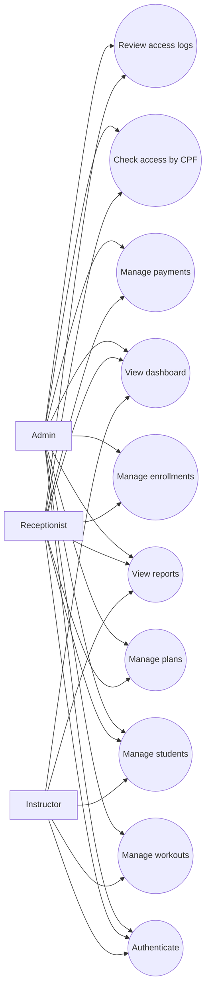
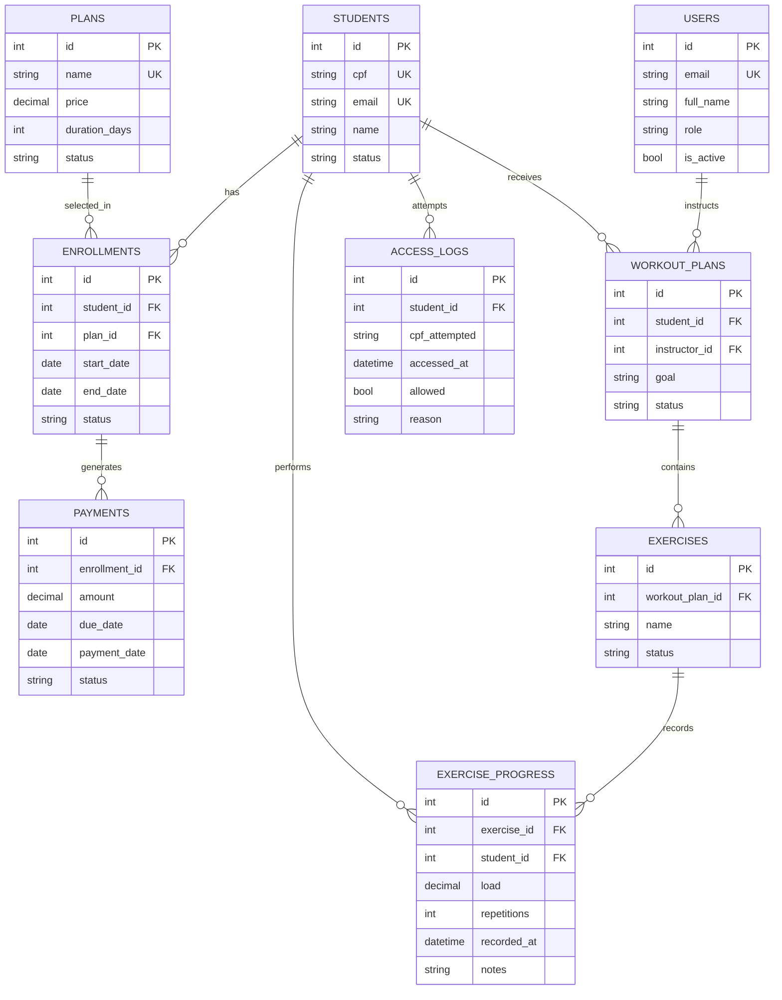
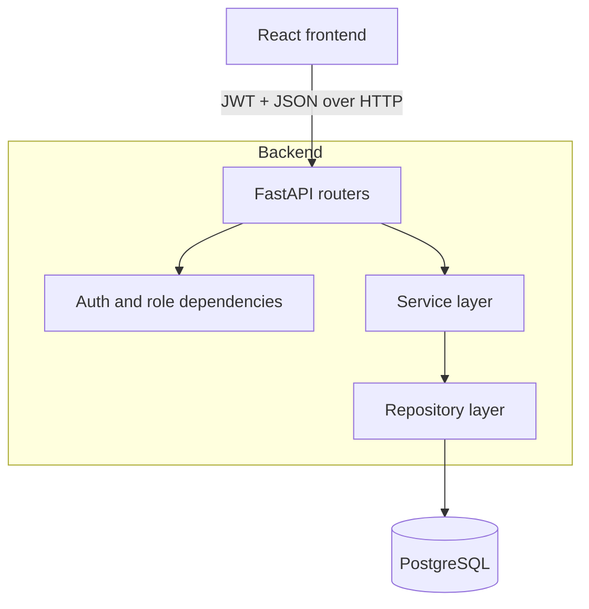

# Architecture Overview

The project uses a layered FastAPI backend and a React frontend. The v1.0.0 MVP covers authentication, students, plans, enrollments, payments, access control, workouts, reports, and dashboard workflows.

Backend flow:

```text
API Layer
↓
Service Layer
↓
Repository Layer
↓
Database Layer
```

## Diagrams

### Use Case Diagram



### ER Diagram



### Architecture Diagram



Current responsibilities:

- API layer receives HTTP input, applies authentication/authorization dependencies, and returns response models.
- Service layer owns business rules, transaction boundaries, and error mapping.
- Repository layer owns persistence operations and query composition, but does not decide business transactions.
- Database layer owns async SQLAlchemy engine and session factory.
- Core modules own configuration, domain enums, logging, middleware, and exception handling.

Domain enums are centralized in `backend/app/core/enums.py`.

Student status represents only cadastral state:

- `ACTIVE`
- `INACTIVE`

Delinquency is derived from payments, not stored on the student. Payment statuses are:

- `PENDING`
- `PAID`
- `OVERDUE`

Plan statuses are:

- `ACTIVE`
- `INACTIVE`

Enrollment statuses are:

- `ACTIVE`
- `EXPIRED`
- `CANCELLED`

Access control is calculated by `AccessControlService`. Access is allowed only when the student exists, is active, has an active non-expired enrollment, and the active enrollment has no overdue payment. Every access attempt creates an `AccessLog`, including nonexistent CPF attempts, with `cpf_attempted`, `student_id` when known, timestamp, allowed flag, and denial reason.

Workout domain is split into workout plans, exercises, and exercise progress:

- `WorkoutPlan` links one active student to one active instructor user.
- `Exercise` belongs to a workout plan and is soft-deleted with `INACTIVE` status.
- `ExerciseProgress` is append-only history for student progress on an exercise.

Workout plan and exercise writes are restricted to `ADMIN` and `INSTRUCTOR`. `RECEPTIONIST` can read workout data but cannot create or edit it.

Reports are implemented as a dedicated analytics layer:

- API: `backend/app/api/reports.py`
- Service: `backend/app/services/report_service.py`
- Repository: `backend/app/repositories/report_repository.py`
- Schemas: `backend/app/schemas/reports.py`

Reports are read-only. Aggregated queries stay out of CRUD services. `ReportRepository` uses SQL aggregates, joins, and grouping for active students, defaulters, plan usage, revenue, daily access, and workout summaries. Financial delinquency is derived from `Payment.status = OVERDUE`.

Revenue reports use `Payment.due_date` for optional `start_date` and `end_date` filters. Invalid ranges return 422. Reporting access is role-protected: `ADMIN` can access all reports, `RECEPTIONIST` can access management and financial reports, and `INSTRUCTOR` can access workout summary only.

Reporting indexes are maintained through Alembic for payment status/date, access timestamps, and exercise progress timestamps, while existing indexes on students and enrollment relationships are reused.

Frontend integration is organized as a routed React application:

- `frontend/src/api` contains typed Axios wrappers for auth, students, plans, enrollments, payments, access control, workouts, and reports.
- `frontend/src/contexts/AuthContext.tsx` owns JWT token state, localStorage persistence, `/api/auth/me` hydration, and logout.
- `frontend/src/routes` owns protected routes and role gates.
- `frontend/src/layouts/AppLayout.tsx` provides the authenticated shell and navigation.
- `frontend/src/pages` contains the first operational screens for dashboard, CRUD workflows, access checks, workouts, and reports.

The frontend stores the access token in localStorage for this phase and attaches it through the shared Axios client. Navigation is role-aware and hides inaccessible areas, but backend authorization remains the source of truth.

Known frontend limitations:

- Refresh tokens are not implemented because the backend does not expose them.
- Reporting and dashboard charts are operational summaries, not advanced analytics or exports.
- Relationship selection remains ID-based in some operational forms.

Phase 8 adds operational UX structure on top of the first integration:

- Dashboard cards and charts consume only the reporting API.
- Recharts renders revenue, daily access, plan usage, and workout activity visualizations.
- `DataTable` centralizes loading, empty, sorting, pagination, sticky headers, and responsive overflow behavior.
- `react-hot-toast` provides lightweight user feedback for auth, mutations, access checks, and API failures.
- Access control keeps recent checks in frontend session state for immediate operator feedback; persisted audit logs are exposed through `GET /api/access/logs`.
- Backend filtering was extended minimally where the UI needed server-side support: student and plan status filters, student search for enrollments and payments, and student/instructor/status filters for workout plans.

The dashboard remains role-aware:

- `ADMIN` sees management, financial, access, plan usage, and workout metrics.
- `RECEPTIONIST` sees management, financial, access, and plan usage metrics.
- `INSTRUCTOR` sees workout summary metrics only.

Known Phase 8 limitations:

- Charts are simple operational summaries, not an advanced analytics engine.
- Relationship selection remains ID-based.
- Tablet responsiveness is prioritized; mobile polish remains limited.

Phase 9 hardening adds release-candidate stability work:

- Backend validation normalizes CPF values and rejects unreasonable student birth dates.
- Payment processing rejects duplicate paid-payment processing.
- Exercise progress requires active exercises.
- JWT edge cases for expired, malformed, and invalid-signature tokens are covered by tests.
- CORS is explicit and production settings reject wildcard origins.
- Request logging includes a request id, HTTP method, path, status code, response duration, and authenticated user id when a valid token is present.
- Frontend heavy routes are lazy-loaded with `React.lazy` and `Suspense`.
- API error messaging distinguishes network failures, timeouts, expired sessions, and permission failures.
- Docker supports a production backend install mode without development dependencies through `INSTALL_DEV=false`.

Production configuration is separated through `.env.production.example` files for backend and frontend. Production deployments must use unique secrets, explicit CORS origins, `DEBUG=false`, and environment-specific API/database URLs.

Phase 10 prepares the v1.0.0 release candidate:

- Backend OpenAPI metadata and package metadata are aligned to `1.0.0`.
- Docker Compose starts the backend without development reload by default and still applies Alembic migrations before startup.
- README, changelog, release notes, contributor guidance, and AI-agent guidance document release validation and known limitations.
- The MVP intentionally excludes payment gateway integration, refresh tokens, email notifications, CSV/PDF exports, hardware/catraca integration, mobile apps, Redis, Kubernetes, and CI/CD pipelines.
